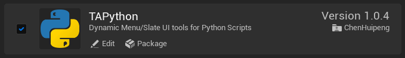
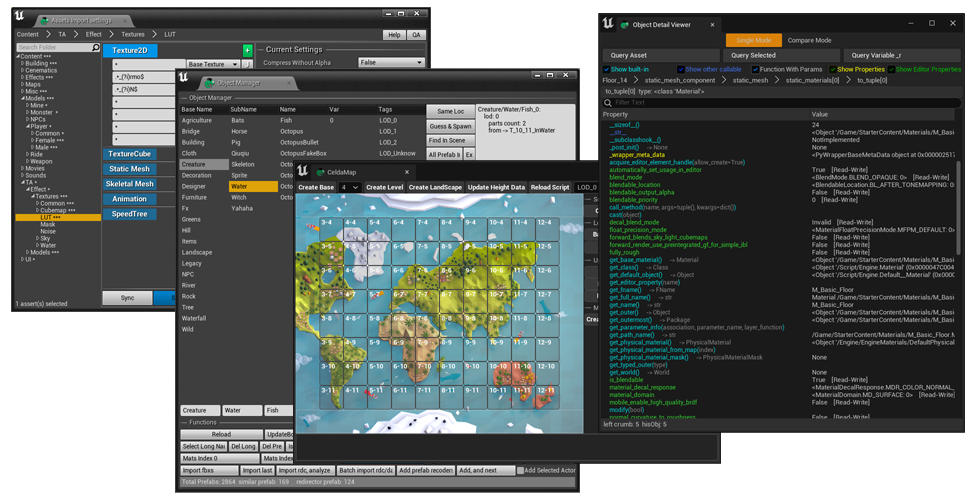
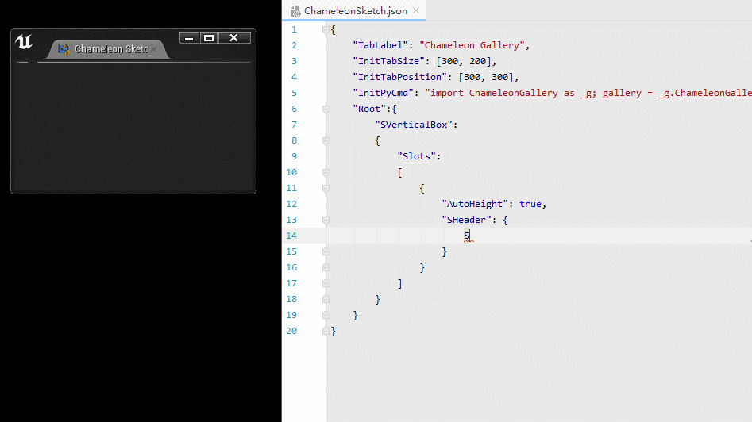

# TAPython_DefaultResources
This repo contains the UE Plugin [TAPython](https://tacolor.xyz/pages/TAPython.html) Default Resources. Both menu and demo tools created by [TAPython](https://tacolor.xyz/pages/TAPython.html).

## Documentation of the TAPython
- [Widget Gallery](https://tacolor.xyz/pages/ChameleonGallery.html)

- [Supported Slates](https://tacolor.xyz/pages/SupportedSlates.html)

- [ChameleonData API](https://tacolor.xyz/pages/ChameleonDataAPI.html)

- [PythonLib API](https://tacolor.xyz/pages/PythonEditorLib.html)

## branches: 

- master: The latest DefaultResources for latest [Unreal Engine](https://www.unrealengine.com), current is UE 5.0 preview 1
- 5_0_ea: The DefaultResources for Unreal Engine 5.0 EA

UE4.26, 4.27 branches will coming soon.

